# warehouse.Api

A small Web API for a warehouse, built with ASP.NET Core (.NET 10)

Then open Swagger: http://localhost:5057/swagger

### Supplier module

I added a supplier model with Id, Name, Country, ContactEmail, PhoneNumber and IsActive.
I also added a CreateSupplierRequest DTO, a SupplierService, and a SuppliersController.
The controller doesn't do the work itself, it just calls the service.
The service is registered in Program.cs

Files I added:

- models/Supplier.cs
- Contracts/CreateSupplierRequest.cs
- Services/SupplierService.cs
- Controllers/SuppliersController.cs
- data/FakeSupplierStore.cs (3 suppliers to start with)

Endpoints:

- GET /api/suppliers - returns all suppliers
- GET /api/suppliers/{id} - returns 404 if the id doesn't exist
- POST /api/suppliers - returns 201, or 400 if the email or phone is not valid
- DELETE /api/suppliers/{id} - doesn't really delete, it just sets IsActive to false and returns 204

### Product-supplier link

POST /api/products/{id}/assign-supplier/{supplierId}

This sets SupplierId on the product and also updates SupplierName so they stay the same.
I added SupplierId to the Product model for this.

The checks are:

- product doesn't exist -> 404
- supplier doesn't exist -> 404
- product is archived -> 409

## Additional endpoints

These are the product endpoints from the earlier tasks:

- GET /api/products - onlyAvailable only shows items in stock, includeArchived shows archived ones too
- GET /api/products/{id}
- GET /api/products/search - search by name and/or supplier
- POST /api/products
- POST /api/products/{id}/price
- POST /api/products/{id}/quantity
- POST /api/products/{id}/image - jpg or png, max 2 MB, saved in wwwroot/uploads
- DELETE /api/products/{id} - archives the product instead of deleting it

## Swagger screenshots

### Products

GET /api/products and its parameters:

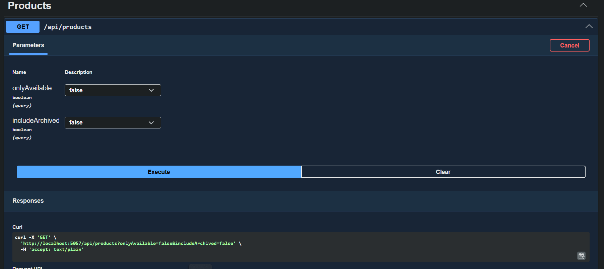

The response:

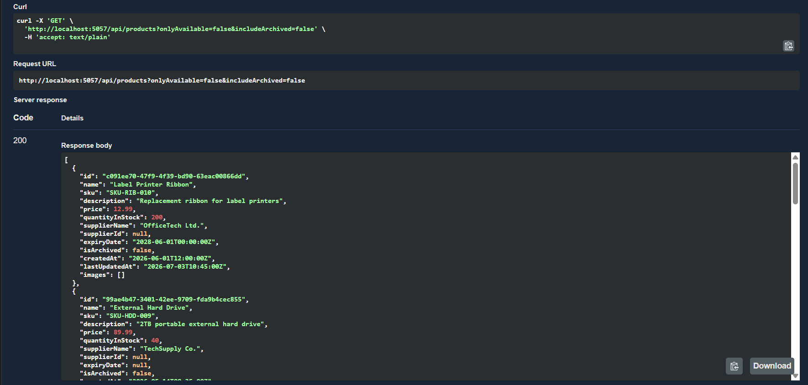

Getting a product with an id that doesn't exist gives 404:

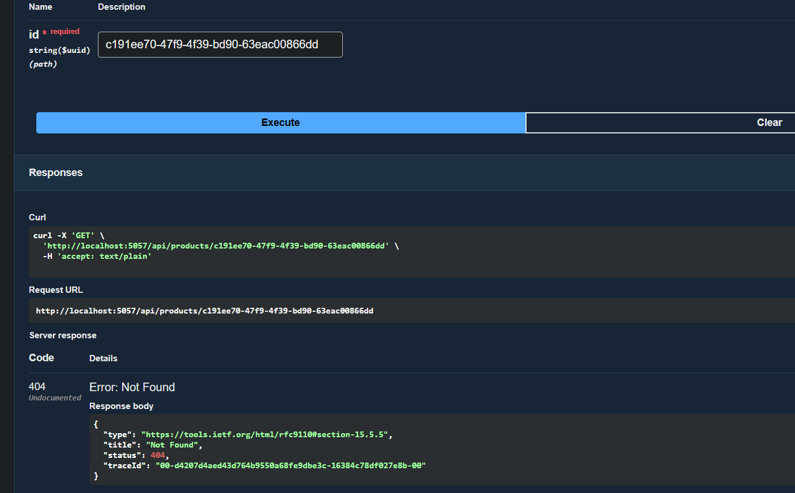

### Delete

Deleting a product returns 204:

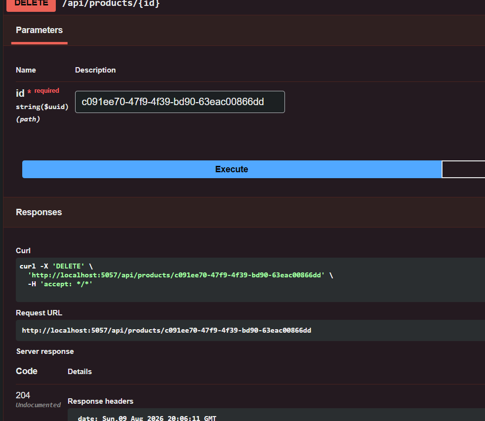

And after that, getting the same product gives 404, because it's archived now:

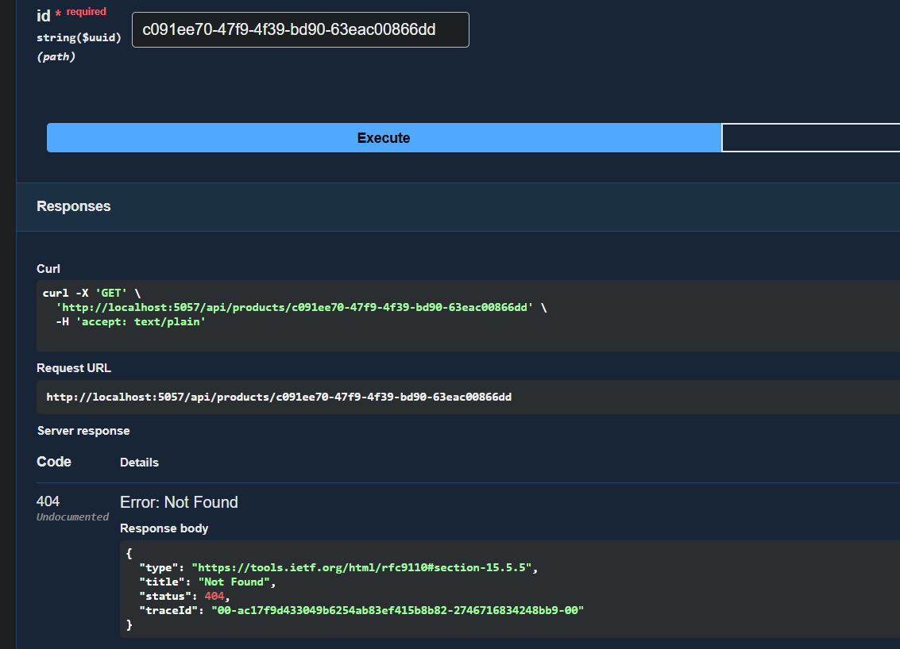

### Updating the price

The request:

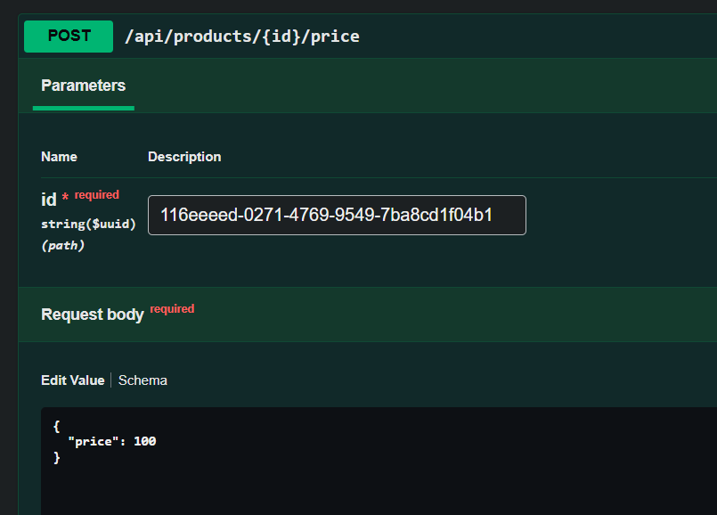

The response with the new price:

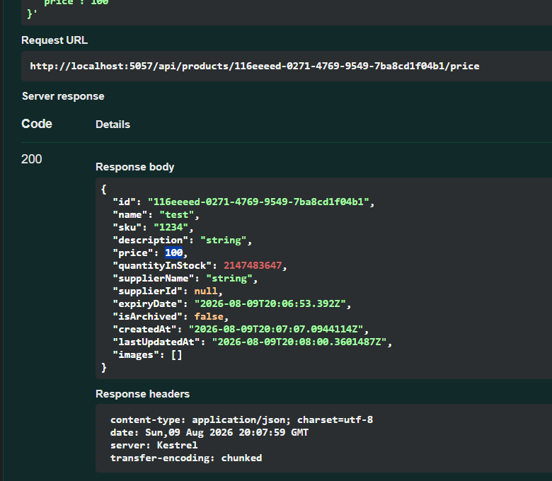

### Server time

I sent ar-lb in lowercase and it still worked, the date comes back in Arabic:

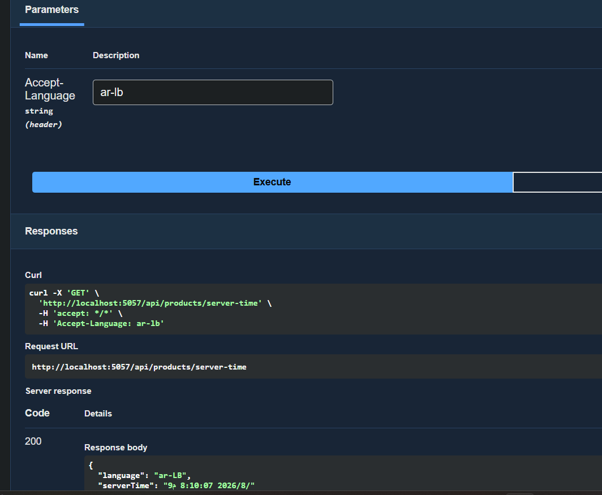

### Suppliers

All 3 suppliers, all active:

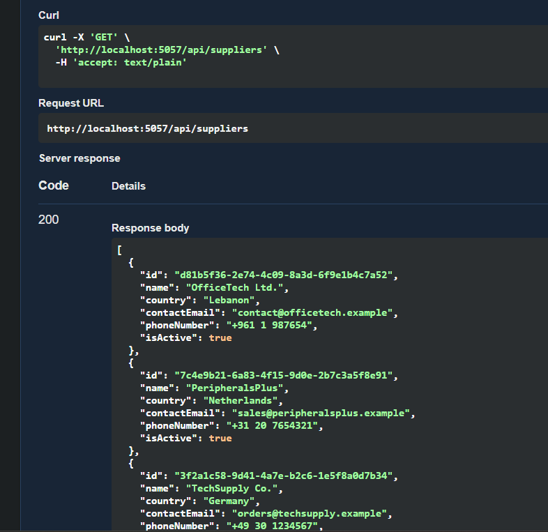

Deactivating one of them:

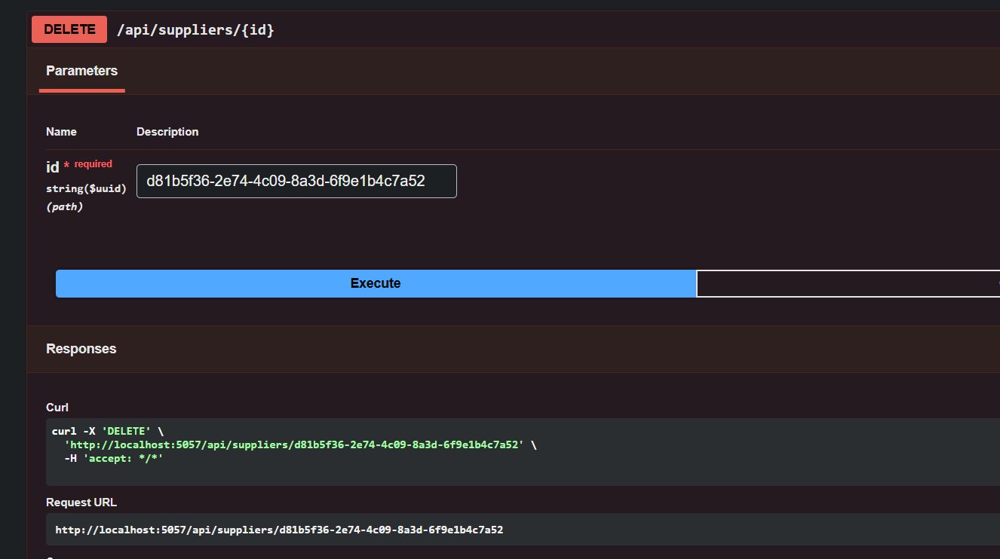

Now OfficeTech Ltd. has isActive false, but it's still there:

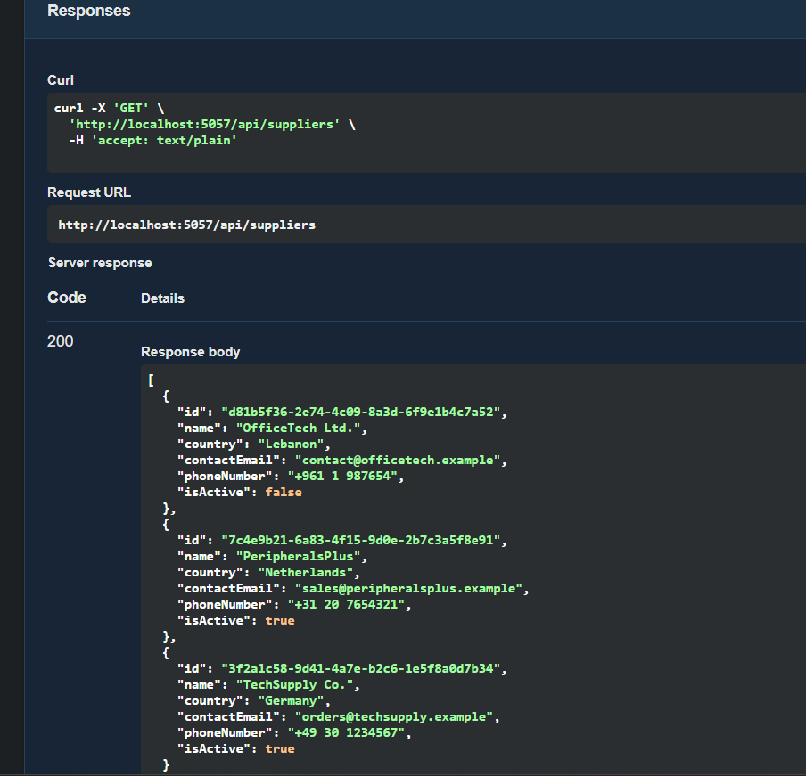

